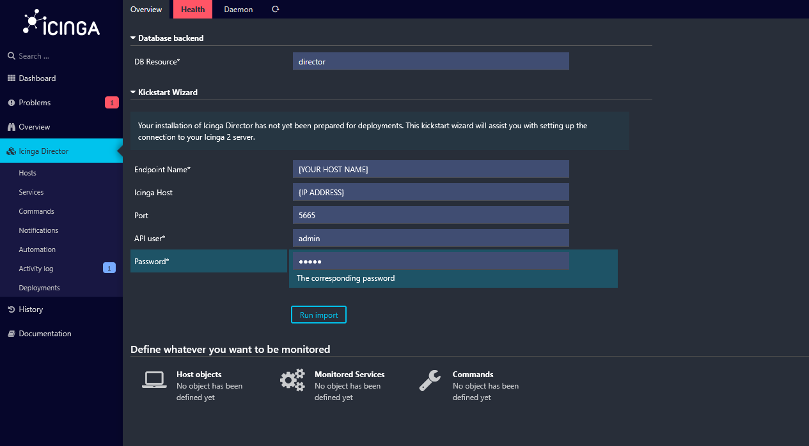
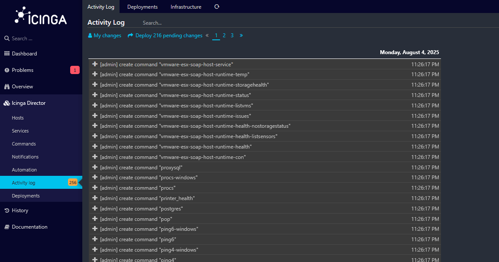

= Configure the Icinga2 Director

In this section the Director configuration happens.

Navigate using the Menu on the left. Configure using the image below and click import:

After that navigate to the Activity Log on the left Menu and click on Deploy Pending changes at the top:

