= Configure IcingaWeb2

In this section the initial configuration happens.

By running the following command you should already have your token:
----
icingacli setup token show
----

Enter it and press Next:

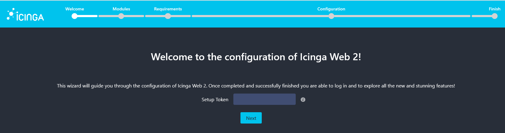

Enable the Modules that you need and press Next:

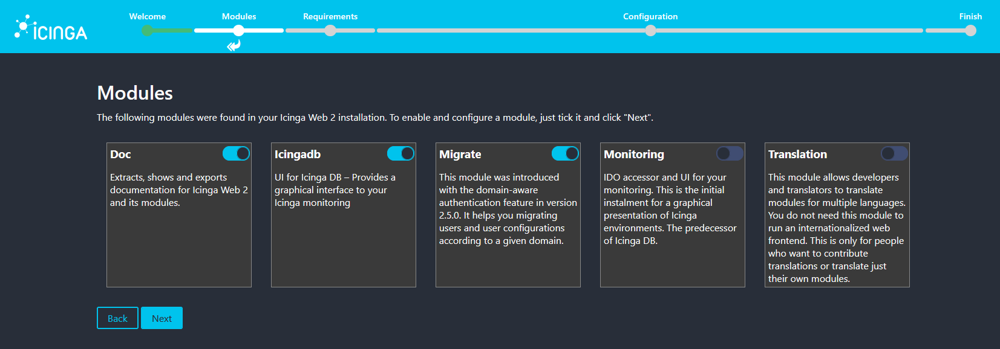

Leave the Authentication as is and press Next:

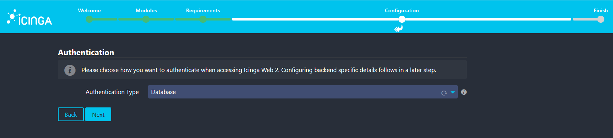

Fill in the Database Resource that will store your usernames and passwords. This is a good place to roll back when your LDAPs fails. Validate using:

Username: postgres +
Password: postgres

and click Next:

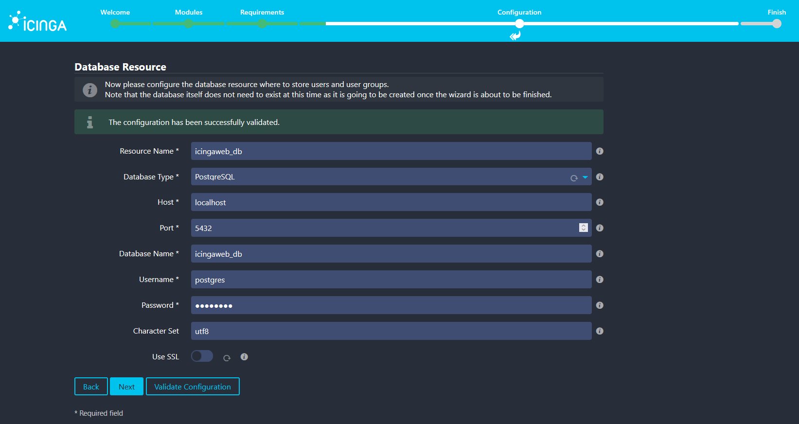

Leave the authentication backend as is and click Next:

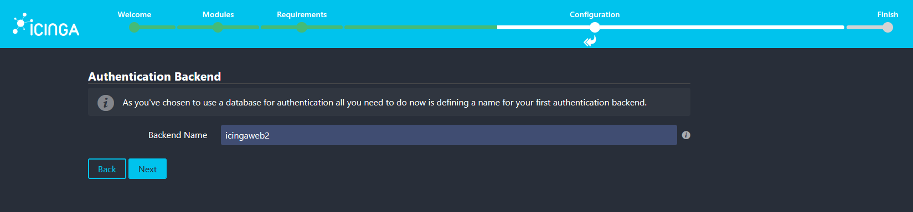

Create your Admin account. For the sake of simplicity:

Username: admin +
Password: admin

and click Next:

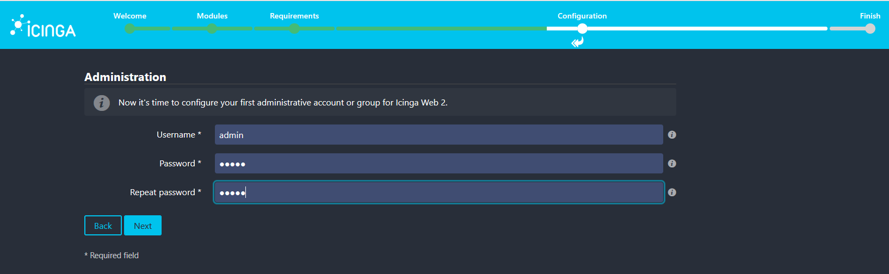

Leave the Application Configuration as is and click Next:

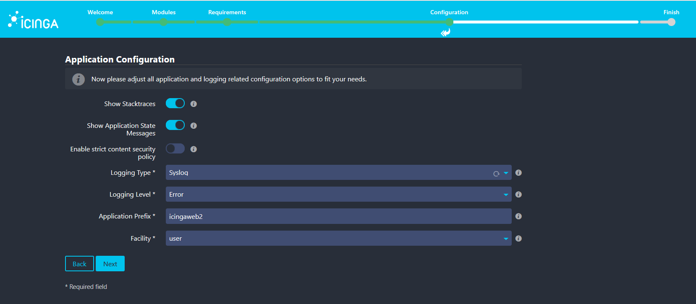

Now it is time to configure Icingaweb2:

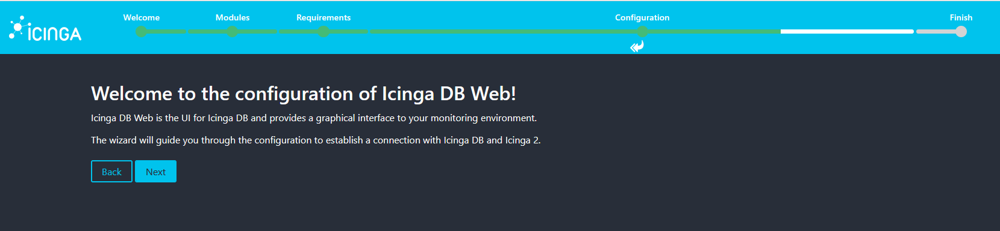

Create and configure your IcingaDB Resource. For the sake of simplicity:

Username: icingadb +
Password: icingadb

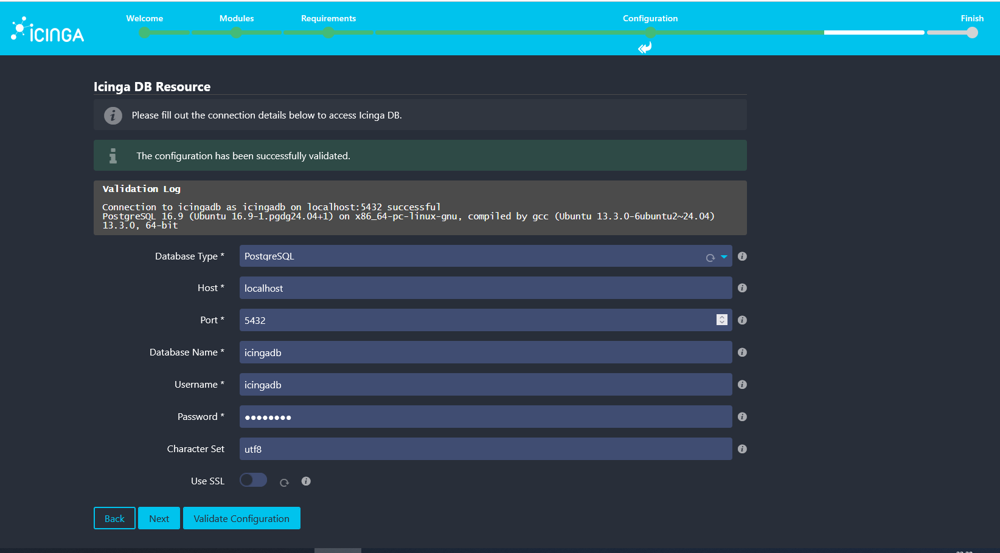

Configure Redis. No username and password are needed.

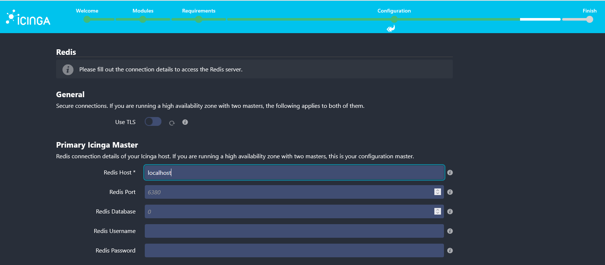

Configure the API connection, Validate and click Next:

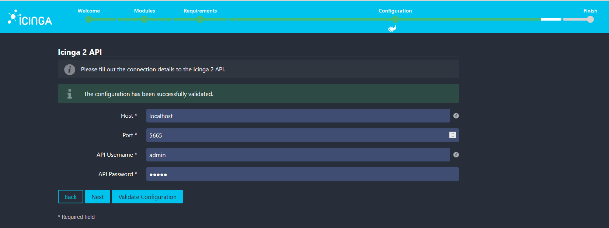

And Finish:

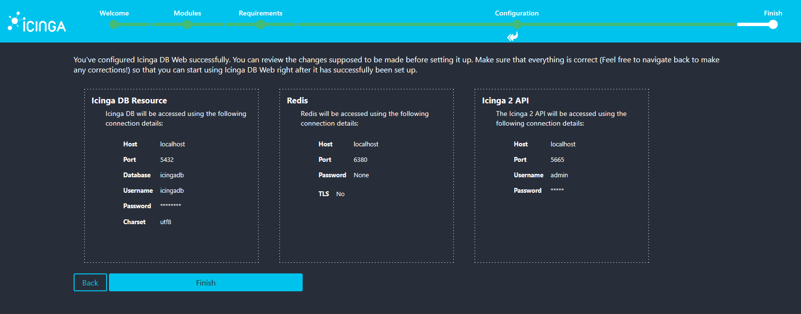

Now Login using admin/admin:

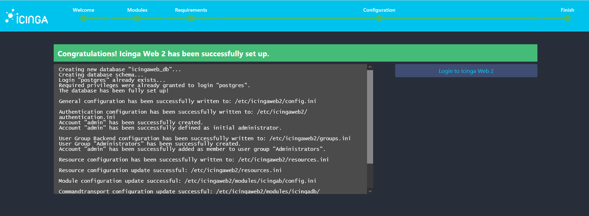
